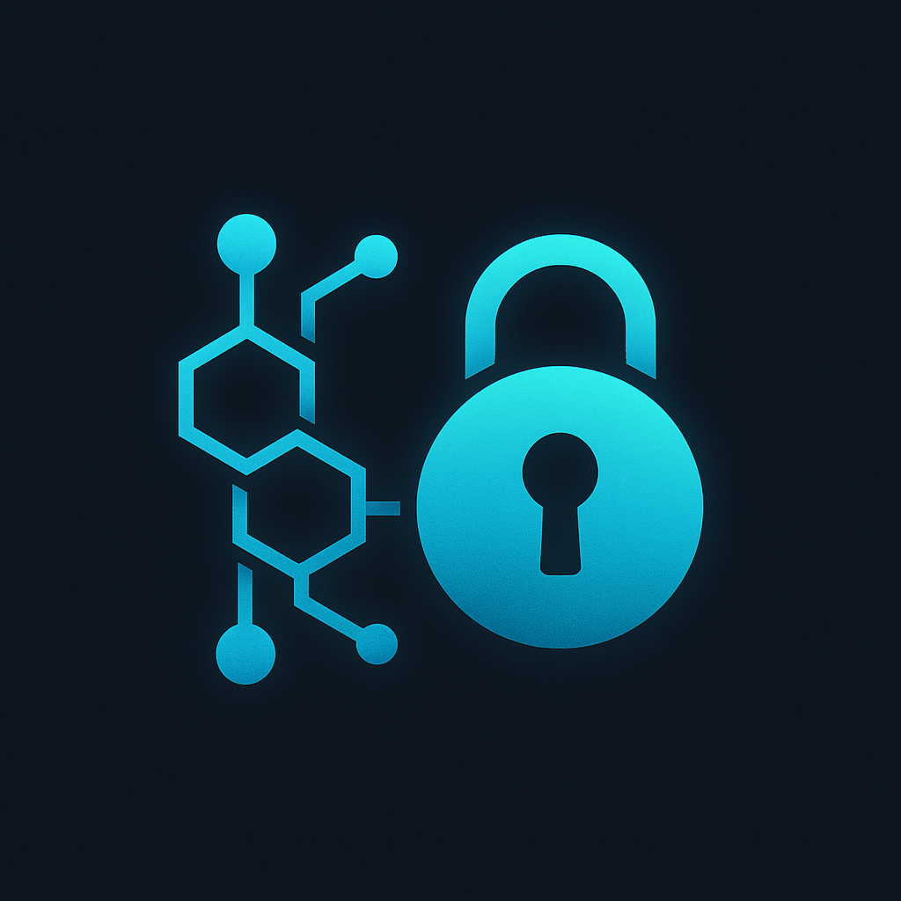
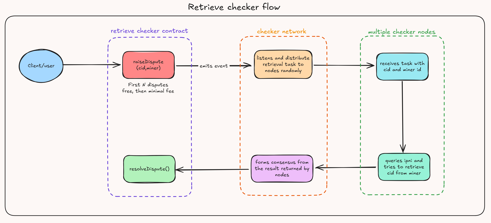
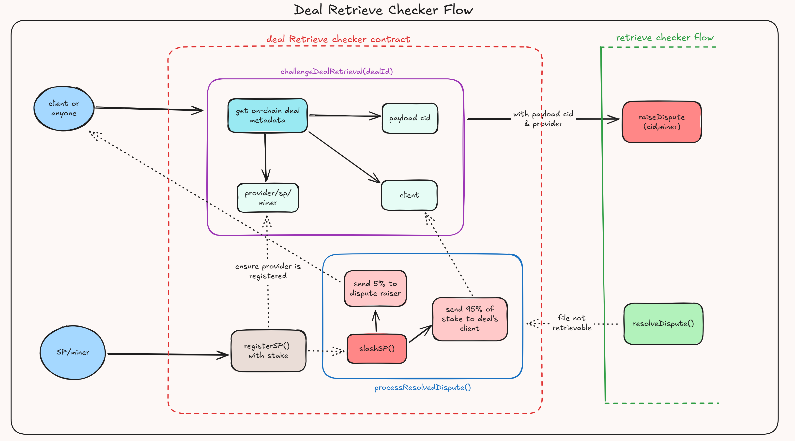

[![Contributors][contributors-shield]][contributors-url]
[![Forks][forks-shield]][forks-url]
[![Stargazers][stars-shield]][stars-url]
[![Issues][issues-shield]][issues-url]
[![project_license][license-shield]][license-url]


<!-- PROJECT LOGO -->
<br />
<div align="center">
  <a href="https://github.com/lordshashank/retrieve-checker-demo">
    
  </a>

<h3 align="center">Deal Retrieve Checker</h3>

  <p align="center">
    On-Chain Reliability for Decentralized Storage Clients
    <br />
    <a href="https://retrieve-checker-demo.vercel.app/"><strong>Explore Dapp</strong></a>
    <br />
    <br />
    <a href="https://youtu.be/v9IzJxaOUiM">View Demo</a>
    &middot;
    <a href="https://github.com/lordshashank/retrieve-checker-demo/issues/new?labels=bug&template=bug-report---.md">Report Bug</a>
    &middot;
    <a href="https://github.com/lordshashank/retrieve-checker-demo/issues/new?labels=enhancement&template=feature-request---.md">Request Feature</a>
  </p>
</div>

## 📑 Table of Contents
- [Overview](#overview)
- [Problem Statement](#-problem-statement)
- [Project Aims](#-project-aims)
- [Solution](#-solution)
- [Key Features](#-key-features)
- [Technical Architecture](#-technical-architecture)
- [How It Enhances Filecoin & Checker Network](#-how-it-enhances-filecoin--checker-network)
- [Getting Started](#-getting-started)
- [Usage](#-usage)
- [Future Plans](#-future-plans)
- [Security Considerations](#-security-considerations)
- [Contributing](#-contributing)
- [License](#-license)
- [Acknowledgements](#-acknowledgements)
- [Contact](#-contact)

## Overview

Deal Retrieve Checker is a decentralized solution for verifying and ensuring the reliability of data retrieval in Filecoin's storage ecosystem. This project enhances the Filecoin network by implementing a dispute resolution system that validates storage providers' abilities to reliably serve stored content, creating a more accountable and transparent storage marketplace.


## 🔍 Problem Statement

As we enter a new era defined by AI breakthroughs and the growth of DePIN (Decentralized Physical Infrastructure Networks), the importance of not just storing—but efficiently retrieving data—has never been more critical.

AI models increasingly rely on real-time, large-scale data access. Meanwhile, DePIN systems—from edge computing to IoT—demand reliable, verifiable data availability across trustless networks. This shift calls for infrastructure where retrieval is as decentralized and resilient as storage.

That’s where Filecoin steps in.

Filecoin has redefined decentralized storage by creating a robust, trustless marketplace for storing verifiable data. But now, with advancements like retrieval markets and retrieval incentives, it's evolving into a truly end-to-end decentralized storage and retrieval layer for the internet.

Our dApp builds on this foundation—designed not just to store data securely, but to ensure it can be retrieved fast, privately, and reliably—powering the needs of AI workloads, real-time DePIN apps, and beyond.

In a world where storage is decentralized but access is everything, Filecoin’s retrieval layer is the missing puzzle piece—and we’re building right on top of it.

In decentralized storage networks like Filecoin, while storage proofs ensure data is initially stored correctly, there's often no reliable mechanism to verify ongoing retrieval capabilities. Storage providers might store data correctly but fail to serve it efficiently (or at all) when requested. Deal Retrieve Checker addresses this critical gap in the storage ecosystem.

## 🎯 Project Aims

- **Enhance Retrieval Reliability**: Establish a robust system to verify that storage providers can efficiently serve content when requested
- **Strengthen SLA Guarantees**: Implement Service Level Agreement enforcement for Filecoin storage deals
- **Protect Clients**: Provide recourse for clients when data cannot be retrieved from storage providers
- **Economic Incentives**: Create a staking mechanism that incentivizes reliable service from storage providers
- **Transparent Dispute Resolution**: Enable fair and transparent resolution of retrieval disputes

## 💡 Solution

Deal Retrieve Checker introduces a comprehensive solution with two key smart contracts:

1. **RetrieveChecker**: Manages the dispute raising and resolution process from the checker network. The flow looks like following:



Checker network has a smart contract implementation as [here](contracts/contracts/RetrieveChecker.sol). It provides `raiseDispute()` functionality that can be used by anyone to raise a dispute corresponding to a particular `cid` and `storageProvider` in Filecoin. It then distributes the retrieval task to checker nodes running the RETRIEVE CHECKER SUBNET implemented at https://github.com/lordshashank/retrieve-checker.

These nodes submit the result of retrieval tasks to the checker network which then submits the result on-chain using the `resolveDispute()` function.

2. **DealRetrieve Checker**: Retrieve Checker is a general implementation which can be used by anyone to develop a market around retrieval SLA.

Deal Retrieve Checker is one such example. It allows anyone to challenge deal retrieval in Filecoin and get rewarded if an SP is not providing retrieval. The flow looks like following:



The technical flow works as follows:
1. Storage providers register by staking tokens (minimum stake required)
2. Users identify deals with potential retrieval issues
3. Users raise disputes by specifying deal ID and provider
4. The `challengeDealRetrieval` function retrieves the on-chain payload-cid and raises the dispute with the retrieve-checker contract with this cid and SP
5. Checker network verifies the retrieval capability
6. Disputes are resolved as either:
   - RESOLVED (retrieval worked, challenge failed)
   - FAILED (retrieval failed, challenge succeeded)
   - REJECTED (invalid challenge)
7. For resolved disputes where retrieval failed:
   - Provider is penalized (stake is reduced)
   - Dispute raiser receives a reward
   - Client receives a portion of the penalty

The system creates accountability through economic incentives and transparent dispute resolution, ensuring that storage providers maintain their retrieval capabilities throughout the lifetime of a deal.


## ⚙️ Key Features

- **Storage Provider Registration**: SPs stake tokens as a guarantee of service quality
- **Challenge-Response Mechanism**: Users can challenge SPs to retrieve specific content
- **Decentralized Verification**: Checker network verifies retrieval capabilities
- **Economic Penalties**: Automatic penalties for failed retrievals
- **Reward Distribution**: Rewards for users who identify unreliable providers
- **Comprehensive Statistics**: Track performance metrics for storage providers

## 🛠️ Technical Architecture

### Smart Contracts

1. **RetrieveChecker.sol**
   - Manages dispute lifecycle (raising, resolving)
   - Maintains dispute status (PENDING, RESOLVED, FAILED, REJECTED)
   - Secures the verification process

2. **DealRetrieveSLA.sol**
   - Handles SP registration and staking
   - Enforces penalties for failed retrievals
   - Distributes rewards to dispute raisers
   - Tracks provider performance statistics

### Frontend Application

1. **User Interface**
   - Modern React/Next.js application with dark-themed UI
   - Responsive design for mobile and desktop users
   - Wallet connection via RainbowKit integration

2. **Core Functionalities**
   - **Deal Explorer**: Search and inspect Filecoin storage deals by ID
   - **Challenge Interface**: Submit retrieval challenges with detailed reasoning
   - **Storage Provider Registry**: View registered SPs and their performance metrics
   - **User Dashboard**: Track personal challenges and their status
   - **Real-time Updates**: Monitor dispute resolution progress

3. **Web3 Integration**
   - Direct smart contract interaction through wagmi hooks
   - Support for Filecoin mainnet and calibration testnet
   - Transaction status tracking with confirmation notifications

## 🔗 How It Enhances Filecoin & Checker Network

### For Filecoin
- **Solving the Retrieval Verification Gap**: Currently, Filecoin lacks a robust mechanism to verify that stored data can actually be retrieved. While storage proofs ensure data is stored correctly, there's no on-chain solution to verify or enforce retrieval capabilities.
- **Enabling FVM-Based Retrieval dApps**: This project creates the foundational infrastructure for developers to build retrieval-focused decentralized applications on the Filecoin Virtual Machine (FVM), opening up an entirely new category of applications.
- **Customizable Storage Markets**: By providing a retrieval verification system, developers can now create customized storage markets with enforceable Service Level Agreements that include both storage and retrieval guarantees.
- **Enhanced Reliability**: Creates accountability for the retrieval phase of storage deals, addressing a critical missing component in the Filecoin ecosystem.
- **Market Confidence**: Builds trust by ensuring providers maintain retrieval capabilities throughout the entire lifecycle of deals.
- **Quality Metrics**: Provides transparent metrics on provider reliability that were previously unavailable.
- **Economic Alignment**: Aligns economic incentives with reliable service provision, creating a more balanced marketplace.

### For Checker Network
- **Beyond Spark Checker's Limitations**: While the existing Spark Checker provides a score to Storage Providers by checking deal file headers, it doesn't actually guarantee retrieval capabilities to clients. The Retrieve Checker subnet takes this several steps further.
- **True Retrieval Guarantees**: Implements actual retrieval verification rather than just checking file headers, ensuring data can truly be accessed when needed.
- **Enabling Retrieval SLAs**: Provides the critical infrastructure for developers to create enforceable retrieval Service Level Agreements - a significant advancement toward a complete on-chain storage marketplace.
- **Extended Functionality**: Adds comprehensive retrieval verification to the checker network's capabilities.
- **New Verification Type**: Implements a new type of on-chain verification challenge with real-world utility.
- **Economic Opportunity**: Creates new earning opportunities for checker nodes that participate in retrieval verification.
- **Network Utility**: Substantially increases the utility and value of the checker network by solving a critical problem in decentralized storage.

## 🚀 Getting Started

### Prerequisites

- Node.js (v16 or later)
- npm or yarn
- Hardhat
- MetaMask or another Web3 wallet
- Access to Filecoin testnet/mainnet

### Installation

1. Clone the repository
```bash
git clone https://github.com/lordshashank/retrieve-checker-demo
cd deal-retrieve-checker
```

2. Install dependencies
```bash
# Install contract dependencies
cd contracts
npm install

# Install frontend dependencies
cd ../frontend
npm install
```

3. Configure environment
```bash
# In the frontend directory
cp .env.example .env.local
```
Edit `.env.local` to add your contract addresses and API keys.

4. Deploy contracts (for development)
```bash
cd ../contracts
npx hardhat run scripts/deploy-all.js --network calibration
```

5. Start the frontend application
```bash
cd ../frontend
npm run dev
```


## 💻 Usage

### For Storage Providers

1. **Register as Storage Provider**:
   - Connect wallet
   - Navigate to "Storage Provider" section
   - Enter your Filecoin actor ID
   - Stake the required minimum amount

2. **Manage Stake**:
   - Add more stake to improve trust score
   - View your performance statistics
   - Review disputes against your service

### For Users

1. **Challenge a Deal**:
   - Connect wallet
   - Navigate to "Challenge Deal" section
   - Enter the Deal ID with retrieval issues
   - Provide a reason for the challenge
   - Submit the challenge with the required fee

2. **View Your Challenges**:
   - Check the status of your raised disputes
   - See rewards earned from successful challenges
   - Track resolutions of your disputes

3. **Explore Registered SPs**:
   - View registered storage providers
   - Examine their performance metrics
   - Make informed decisions for your storage needs


## 🚀 Future Plans

This project represents a minimal market implementation around the Retrieve Checker contract. Our vision extends much further:

- **Robust Market Development**: Build a more sophisticated and well-defined market for retrieval guarantees with advanced pricing mechanisms and reputation systems

- **Checker Network Integration**: We're awaiting Checker Network to integrate our flow and deploy the Retrieve Checker subnet we've developed, which will enable on-chain dispute raising and resolution

- **Subnet Expansion**: Increase the number of nodes running the Retrieve Checker subnet to enhance the robustness and decentralization of the verification network

- **Enhanced Analytics**: Implement advanced data visualization and analytics for network performance

- **Cross-chain Support**: Expand functionality to support other blockchain networks beyond Filecoin

The success of this system depends on community participation - particularly running nodes in the verification subnet to ensure truly decentralized assessments of retrieval capabilities.

## 🔒 Security Considerations

- Smart contracts have been developed with security best practices
- Economic parameters are carefully balanced to prevent attacks
- Dispute resolution includes safeguards against malicious challenges
- Staking requirements prevent Sybil attacks

## 🤝 Contributing

Contributions are welcome! Please feel free to submit a Pull Request.

1. Fork the repository
2. Create your feature branch (`git checkout -b feature/amazing-feature`)
3. Commit your changes (`git commit -m 'Add some amazing feature'`)
4. Push to the branch (`git push origin feature/amazing-feature`)
5. Open a Pull Request

## 📃 License

This project is licensed under the MIT License - see the LICENSE file for details.

## 👏 Acknowledgements

- Filecoin Foundation for the inspiration and support
- Checker Network for providing the verification infrastructure
- The entire decentralized storage community for valuable feedback

## 📬 Contact

Shashank - [@lordshashank](https://twitter.com/0xlord_forever) - [GitHub](https://github.com/lordshashank)

Project Link: [https://github.com/lordshashank/retrieve-checker-demo](https://github.com/lordshashank/retrieve-checker-demo)

---

Built with ❤️ for the decentralized storage ecosystem


<!-- MARKDOWN LINKS & IMAGES -->
<!-- https://www.markdownguide.org/basic-syntax/#reference-style-links -->
[contributors-shield]: https://img.shields.io/github/contributors/lordshashank/retrieve-checker-demo.svg?style=for-the-badge
[contributors-url]: https://github.com/lordshashank/retrieve-checker-demo/graphs/contributors
[forks-shield]: https://img.shields.io/github/forks/lordshashank/retrieve-checker-demo.svg?style=for-the-badge
[forks-url]: https://github.com/lordshashank/retrieve-checker-demo/network/members
[stars-shield]: https://img.shields.io/github/stars/lordshashank/retrieve-checker-demo.svg?style=for-the-badge
[stars-url]: https://github.com/lordshashank/retrieve-checker-demo/stargazers
[issues-shield]: https://img.shields.io/github/issues/lordshashank/retrieve-checker-demo.svg?style=for-the-badge
[issues-url]: https://github.com/lordshashank/retrieve-checker-demo/issues
[license-shield]: https://img.shields.io/github/license/lordshashank/retrieve-checker-demo.svg?style=for-the-badge
[license-url]: https://github.com/lordshashank/retrieve-checker-demo/blob/master/LICENSE.txt
[product-screenshot]: images/screenshot.png
